# Project Description

The Library Management System is a web application built to manage books, authors, publishers, and borrowers in a library. It features an Admin Portal for performing CRUD operations on books, authors, and publishers. The User Panel allows registered users to browse, search, and borrow books. Users can also search and filter books by title, author, publisher, and other criteria. To borrow books, users must be registered in the system. This project showcases a full-stack Laravel application with an emphasis on database relationships, user authentication, and responsive front-end design using Bootstrap.


# Prerequisites

Before starting, ensure you have the following installed:

- [PHP](https://www.php.net/)
- [Composer](https://getcomposer.org/)
- [Laravel Installer](https://github.com/laravel/installer)
- Either [Node.js and NPM](https://nodejs.org/en) OR [Bun](https://bun.sh/)

## Installing PHP, Composer, and Laravel Installer

If you don’t have PHP and Composer installed on your machine, follow the instructions below:

### For Windows:

1. Run the following command as an administrator: 
   ```bash
   Set-ExecutionPolicy Bypass -Scope Process -Force; [System.Net.ServicePointManager]::SecurityProtocol = [System.Net.ServicePointManager]::SecurityProtocol -bor 3072; iex ((New-Object System.Net.WebClient).DownloadString('https://php.new/install/windows/8.4'))


### For macOS:

1. Run the following command: 
2. ```bash
    /bin/bash -c "$(curl -fsSL https://php.new/install/mac/8.4)"

### For Linux:

1. Run the following command: 
2. ```bash
    /bin/bash -c "$(curl -fsSL https://php.new/install/linux/8.4)"

After running one of the commands above, restart your terminal session. To update PHP, Composer, and the Laravel installer, simply re-run the command.

## If PHP and Composer Are Already Installed

If PHP and Composer are already installed, you can install the Laravel installer globally via Composer by running the following command:

composer global require laravel/installer


# Installation Steps

Follow the steps below to set up the Laravel project:

## Step 1: Clone the Repository

Clone the project repository to your local machine:

git clone https://github.com/saharshabhatta/Laravel-Project.git

## Step 2: Install PHP Dependencies

Navigate to the project directory and install the necessary PHP dependencies:

composer install

## Step 3: Set Up the Environment

Copy the .env.example file to .env to set up the environment:

cp .env.example .env

Generate the application key:

php artisan key:generate

## Step 4: Install Node.js Dependencies

If your project uses frontend assets managed by Node.js, install the required Node.js dependencies (optional):

npm install

## Step 5: Migrate the Database

Migrate the database to set up the required tables:

php artisan migrate

## Step 6: Serve the Application

Serve the application on your local machine using the built-in Laravel server:

php artisan serve

## Step 7: Access the Application

Now, open your browser and visit the following URL to access the application:

[http://127.0.0.1:8000]


# Usage Guide

## 1. Set Up and Start the Application
Follow the installation guide to set up the application on your local machine.

## 2. Access the Application
Visit the application by navigating to [http://127.0.0.1:8000] in your browser.

## 3. User Dashboard
Upon visiting the site, you will be directed to the **User Dashboard** where you can browse available books. To borrow books, you must first log in.

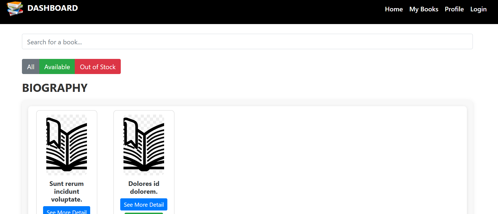

## 4. Login Process
Click on the **Login** option in the navigation bar to be redirected to the login portal.

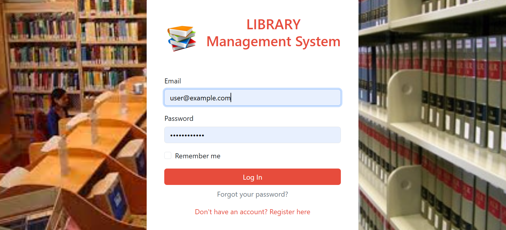

## 5. Account Registration or Login
### 5.1. To register a new account, follow the registration process.

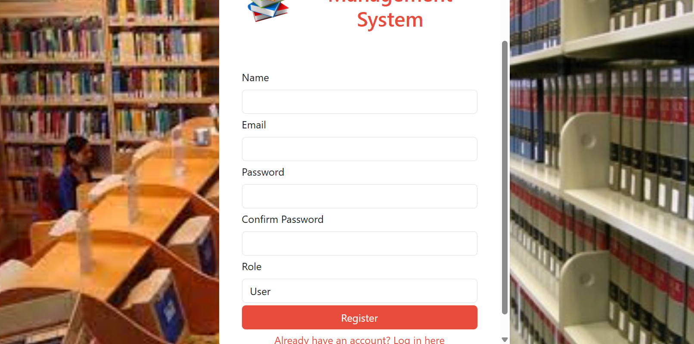

### 5.2. Alternatively, you can use the following credentials to log in: 
   - **Admin**: 
     - Email: `admin@example.com`
     - Password: `adminpassword`
   - **User**: 
     - Email: `user@example.com`
     - Password: `userpassword`

## 6. User Dashboard
After logging in as a user, you will be redirected to the **User Dashboard**, where you can borrow books and edit your profile details.

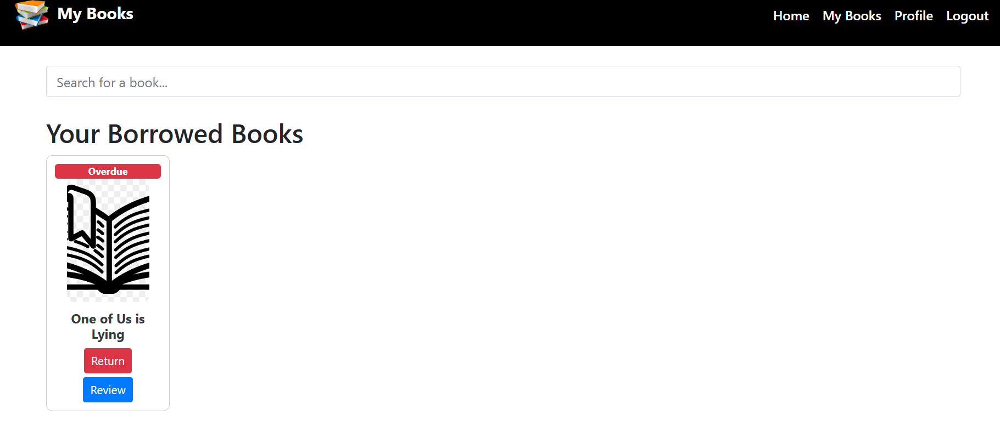

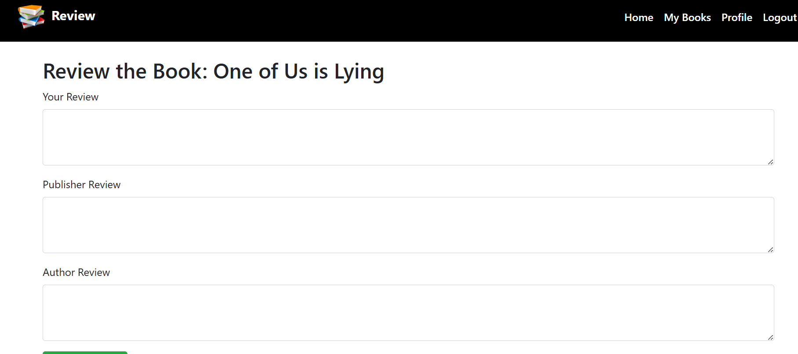

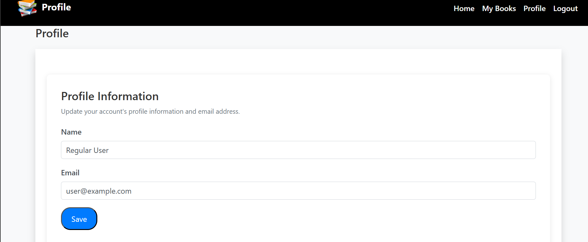

## 7. Admin Dashboard
After logging in as an admin, you will be redirected to the **Admin Dashboard**, where you can:
   - 7.1. Add, edit, or delete books.
   - 7.2. View the list of users who have borrowed books.

   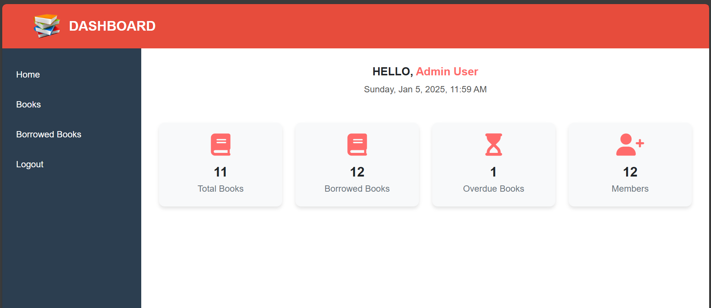

   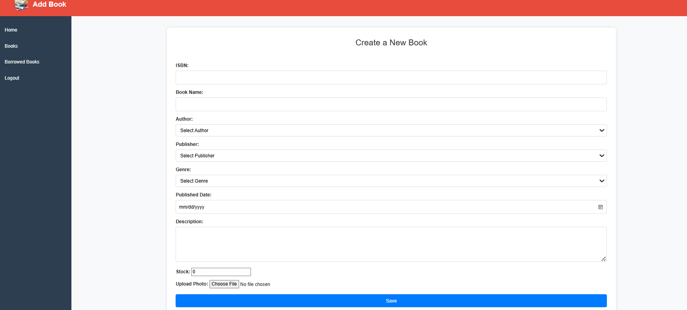

   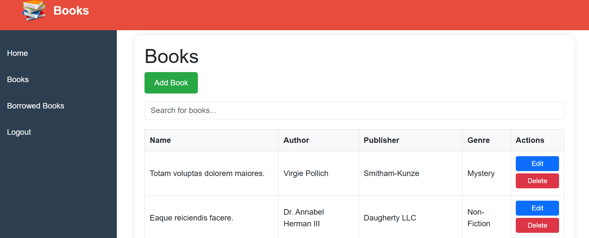

   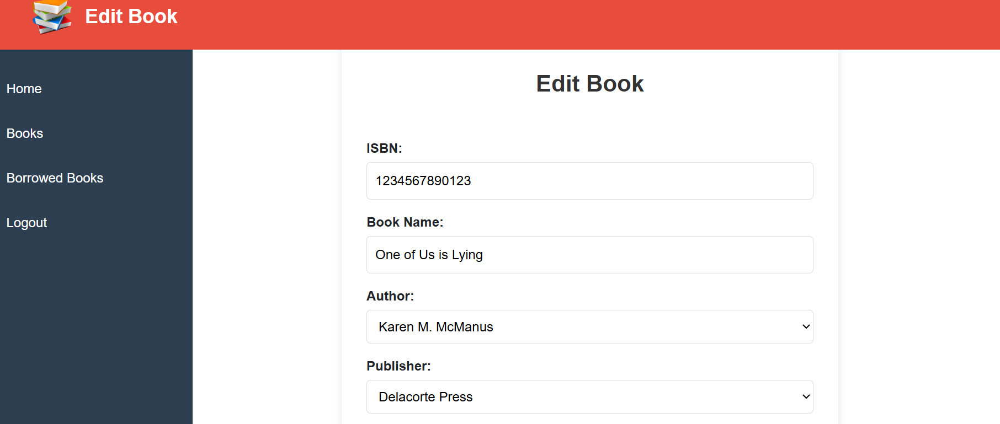

   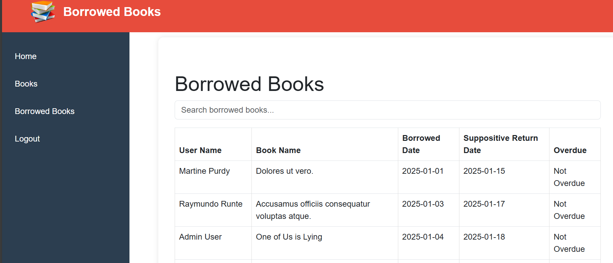